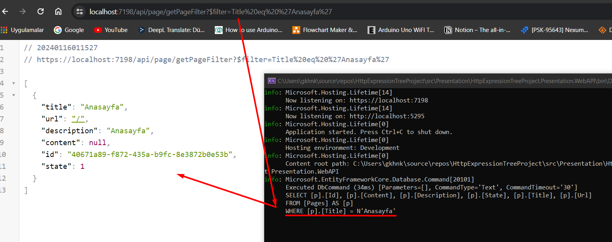
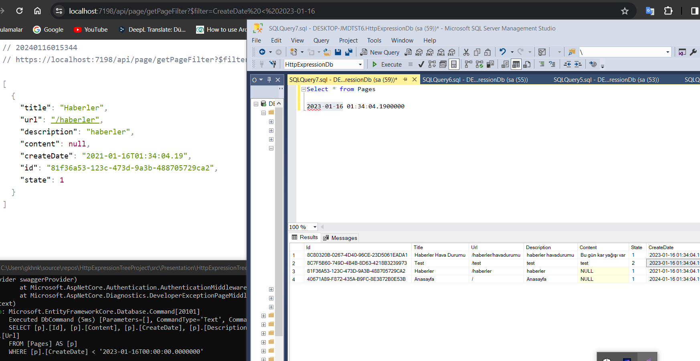
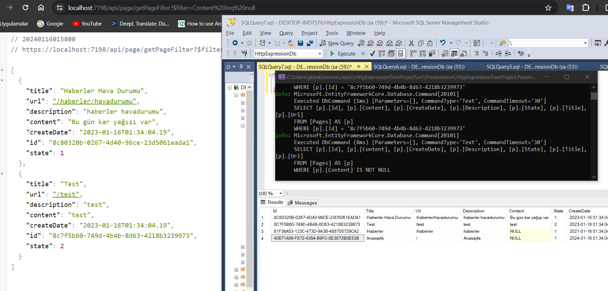
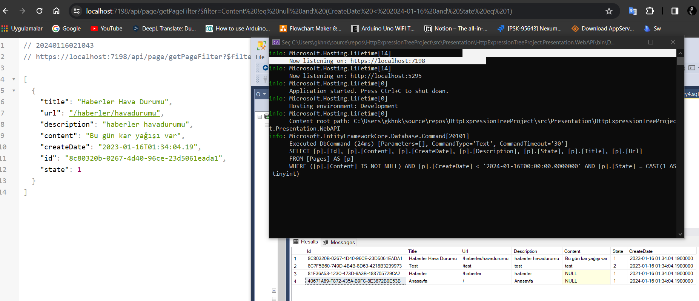

# C# Http Request ile Dinamik Expression Tree

Merhaba arkadaşlar, bu gün sizinde çok fazla kullandığınız ama pek de detayına inmediğimiz bir konu üzerine yaptığım geliştirmeden bahsedeceğim.

## Problemin Doğuşu
Birçoğumuz hızlı bir şekilde proje geliştirmeye çalışırken api ihtiyaçları içerisinde boğulmakta, bazen çok basit işlemleri farklı requestler üzerinden karşılamak zorunda kalıyoruz özellikle zamanın kısıtlı olduğu durumlarda.
Bende bir çok projede bu duruma düşüyorum, yakın bir zamanda çalıştığım proje içerisinde de kısıtlı bir zaman sebebiyle Cms tarafında OData kullanmak durumunda kalmıştık.
Herşey güzeldi fakat Controller katmanında IQueryable<> dönüyor olmamız ve sadece cms internal katmanı için büyük bir nuget paketini indirmek içime sinmemişti(odata güzel detayları olan bir yapı), o günlerde kafamı deli sorular dönmye başladı ve bu gün bu yazıyı yazmama neden olan  **'odata kullandığım gibi bende request üzerinden bir sorgu atsam ve bu sorguyu expression çevirsem nasıl olur acaba ?'**
sorsusunu sormama neden oldu.

> OData Nedir?
Open Data Protocol olarak da isimlendirebileceğimiz OData, veri kaynaklarını REST url üzerinden sorgulama protokolüdür. Microsoft tarafından 2007 yılında geliştirilmeye başlanmıştır. Api uygulamalarında kullanılmakatadır.
OData ile yapacağınız sorguları client tarafına bırakarak, complex ya da tailored endpointler geliştirme maliyetinden kurtulabilirsiniz.
OData action dönüş tipinin IQueryable olması daha performanslı sorgulamalar yapmamızı sağlar.

## Uygulama

Örnek olarak:
/product/filter?$Filter=Title !eq null and (State eq 1 or State eq 2)
gibi bir sorguyu arka Expression çevirecek

     db.Where(x=>x.Title!=null and (x.State == 1 || x.State == 2))
 
veya 

    db.Where(x=>x.Title == "Merhaba Dünya" and x.State == 1)

Üstelik bunu yaparken yazmış olduğum singleton sınıf Expression döneceği için repo katmanımıza kadar taşıma şansımız var yani gün sonunda IQueryable çıktısı çalıştırılacak :smile:

Nasıl sizce bence çok güzel :smile:

## Kod

Herşey HttpExpression adlı  singleton sınıfımda yürütülüyor, tüm işlemleri bir sınıfta yapmak istedim çünkü belki hoşunuza gider ve projenize daha kolay entegre edersiniz 😇

Kod Detayları :
**Link [HttpExpression.cs](https://github.com/keslergokhan/HttpExpressionTreeProject/blob/master/src/Core/HttpExpressionTreeProject.Core.Application/Services/HttpExpression.cs "HttpExpression.cs")**

## Kullanım

### 1) HttpExpression.cs
HttpExpression sınıfını alın ve projenize dahil ediniz

### 2) Controller Extension methodu çalıştırma

Burada httpExpression nesnesini aldıktan sonra bu nesneyi karşılayacak olan bir servis hatmanınız veya hanlder vs ne varsa oraya göndermeniz gerekli

    [HttpGet]
            [Route("GetPageFilter")]
            public async Task<IActionResult> GetPageFilter()
            {
                HttpExpression httpExpression = HttpContext.HttpExpression();
                return Ok(this._pageServicei.GetFilterPages(httpExpression));
            }

### 3) Expression Parse
Bu kod bloğunda bizim için önemli olan kısım '**httpExpression.GetFilterExperssion<Page>()**'  ve onu return değerini where içersine yolluyoruz.

     public List<ReadPageDto> GetFilterPages(HttpExpression httpExpression)
            {
                //Projeyi daha fazla uzatmamak için select kullandım fakat siz mapper kullanın
                return this._readPageRep.GetFilter(httpExpression.GetFilterExperssion<Page>()).Select(x=> new ReadPageDto
                {
                    Id = x.Id,
                    Content = x.Content,
                    Description = x.Description,
                    State = x.State,
                    Title = x.Title,
                    Url = x.Url
                    
                }).ToList();
            }
### Sonuç

Görüldüğü gibi sorgu sql şeklinde iletiliyor ve respone başarılı bir şekilde geliyor 😱,
ve daha güzeli bu bir Expression çıktısı veriyor yani ben bunu repository ilettim fakat siz faha farklı yerlere kullanabiliriniz herhangi bir IEnumerable listesinde de kullanabilirsiniz yani tamamen size kalmış

diğer bir örnek

Tabi bu proje size bir fikir vermesi için yapılmıştır daha geliştirilmesi gerekeen çok fazla noktası var artık bundan sonrası da sizde :relaxed:

## Örnek Sorgular

https://localhost:7198/api/page/getPageFilter?$filter=Content !eq null and (CreateDate < 2024-01-16 and State eq 1)

 
 
 
